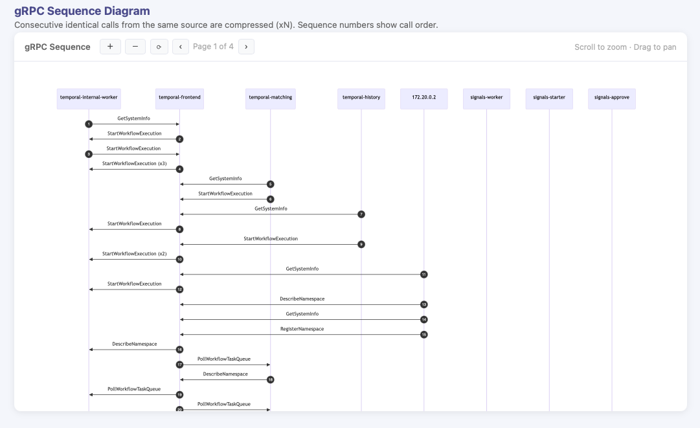

# temporal-lens

A tool for analyzing Temporal `.pcap` captures. Available as a **native desktop GUI** or a **CLI** that writes self-contained HTML and Markdown reports.

> Full end-user documentation is in **[user-guide.md](user-guide.md)**.

---

## What it does

Given a `.pcap` file captured from a running Temporal cluster, `temporal-lens`:

- Decodes all IP packets and gRPC calls from HTTP/2 traffic on Temporal ports
- Resolves container IPs to human-readable names
- Builds interactive **Mermaid diagrams** — data flow, traffic sequence, and gRPC sequence (paginated)
- Generates a **statistics report** — protocol breakdown, connection matrix, network health (RTT, retransmissions), and Temporal-specific insights
- Exposes a **SQL query engine** against the packet and gRPC call data (GUI only)



---

## Installation

### Option A — Download a pre-built release (recommended)

Pre-built releases are published automatically for every tagged release via GitHub Actions.

1. Go to the [Releases page](https://github.com/DCCoder90/temporal-research/releases) and download the archive for your platform:

   | File | Platform | Type |
   |------|----------|------|
   | `temporal-lens-macos-universal.zip` | macOS — Apple Silicon + Intel | GUI + CLI |
   | `temporal-lens-windows-amd64.zip` | Windows — 64-bit | GUI + CLI |
   | `temporal-lens-linux-amd64.zip` | Linux — 64-bit | CLI only |

2. Extract the archive. Each zip contains:

   **macOS:**
   ```
   temporal-lens.app   (universal .app bundle — double-click to launch GUI)
   config.json
   ```

   **Windows / Linux:**
   ```
   temporal-lens   (or temporal-lens.exe on Windows)
   config.json
   ```

3. Move the binary and `config.json` to the same directory, somewhere on your `PATH` (macOS / Linux):

   ```bash
   unzip temporal-lens-macos-arm64.zip -d /usr/local/bin/
   ```

   On Windows, extract the zip and move both files to a folder on your `PATH`.

   > `config.json` must be present alongside the binary (or in `~/.config/temporal-lens/`). The application will not start without it — see [Configuration files](#configuration-files).

   > **macOS Gatekeeper:** the `.app` is not code-signed. The first time you open it, right-click → **Open** and confirm the prompt. Subsequent launches work normally.

3. Install tshark (required at runtime):

   | Platform | Command |
   |----------|---------|
   | macOS | `brew install wireshark` |
   | Ubuntu / Debian | `sudo apt-get install tshark` |
   | Windows | Install [Wireshark](https://www.wireshark.org/download.html); ensure `tshark.exe` is on `PATH` |

4. Verify:

   ```bash
   temporal-lens --version
   # temporal-lens version 1.0.0

   tshark --version
   ```

---

### Option B — Build from source

**Requirements:**

| Dependency | Version | Required for |
|------------|---------|-------------|
| [tshark](https://www.wireshark.org/docs/man-pages/tshark.html) | any recent | runtime (both GUI and CLI) |
| [Go](https://go.dev/dl/) | 1.22+ | building from source |
| [Wails v2](https://wails.io) | v2 | building the GUI only |

**CLI only:**

```bash
cd tools/temporal-lens
go build -tags nogui -o temporal-lens .
mv temporal-lens /usr/local/bin/   # or any directory on PATH
```

**GUI** (macOS .app):

```bash
# Install Wails once
go install github.com/wailsapp/wails/v2/cmd/wails@latest

cd tools/temporal-lens
wails build
# Output: build/bin/temporal-lens.app

cp -r build/bin/temporal-lens.app /Applications/
```

**GUI dev mode** (hot-reload):

```bash
wails dev
```


### GUI (dev mode with hot-reload)

```bash
wails dev
```

---

## Configuration files

`temporal-lens` requires a `config.json` file at startup. If it is missing the application will print an error and exit.

| File | Format | Purpose |
|------|--------|---------|
| `config.json` | JSON | Maps container IPs to names and TCP ports to labels |

**Search locations** (checked in order):
1. Same directory as the binary
2. `~/.config/temporal-lens/`

A default `config.json` matching the standard `temporal-lens` Docker Compose setup is bundled in every release archive. Edit it freely to match your own cluster's IPs and service names.

Example `config.json`:
```json
{
  "hosts": {
    "10.0.0.5": "my-temporal-frontend",
    "10.0.0.6": "my-worker"
  },
  "ports": {
    "7233": "Temporal gRPC (frontend)",
    "5432": "PostgreSQL"
  }
}
```

---

## Quick start

### GUI

Launch the app, drop a `.pcap` file onto the sidebar, optionally set filters, then click **Analyze**. Use the **Diagrams**, **Statistics**, and **Query** tabs to explore the capture. Click **Export** to write `_flow.html` and `_stats.md` alongside the pcap.

### CLI

```bash
# Analyze a capture — writes _flow.html and _stats.md next to the pcap
./temporal-lens captures/temporal_00001.pcap

# gRPC traffic only
./temporal-lens captures/temporal_00001.pcap --only grpc

# Hide internal Temporal services (history, matching, internal-worker)
./temporal-lens captures/temporal_00001.pcap --no-interservice

# Output raw JSON (packets + gRPC calls) to stdout
./temporal-lens captures/temporal_00001.pcap --json --quiet | jq '.grpc_calls | map(.method) | unique'

# Show version
./temporal-lens --version
```

### All CLI flags

| Flag | Short | Description |
|------|-------|-------------|
| `--only <protocols>` | `-o` | Comma-separated protocols to include; all others hidden |
| `--exclude <protocols>` | `-x` | Comma-separated protocols to exclude |
| `--only-host <hosts>` | | Comma-separated container names or IPs to include |
| `--exclude-host <hosts>` | | Comma-separated hosts to exclude |
| `--no-interservice` | | Exclude history, matching, and internal-worker |
| `--json` | | Write analysis result as JSON to stdout instead of files |
| `--quiet` | `-q` | Suppress progress output to stderr |
| `--version` | | Print version and exit |
| `--help` | `-h` | Print usage |

Protocol names: `grpc`, `http2`, `pgsql`, `postgresql`, `http`, `tcp`, `arp`, or any tshark protocol column value.

---

## Output files (CLI / Export)

| File | Description |
|------|-------------|
| `<name>_flow.html` | Self-contained interactive HTML with all three diagrams |
| `<name>_stats.md` | Markdown statistics report |

---

## Project layout

```
app.go                    Wails App struct — Analyze, Export, QueryDB, ResolveIP
query.go                  In-memory SQLite engine (GUI only)
main.go                   GUI entry point (!nogui)
main_nogui.go             CLI-only entry point (nogui build tag)
cli/cli.go                cobra command — flags, --json, --quiet, --version
internal/
  analysis/analysis.go    Pipeline: extract → filter → diagrams → stats
  config/config.go        IP map, port labels, gRPC ports, filter name aliases
  diagram/diagram.go      Mermaid diagram builders (flow, sequence, traffic)
  filter/filter.go        Protocol and host filter logic
  report/report.go        HTML and Markdown report generators
  tshark/tshark.go        tshark invocation, Packet and GRPCCall types
frontend/
  index.html              GUI shell
  src/main.js             All GUI logic (tabs, diagrams, query, history, sort)
  src/style.css           GUI styles
```
